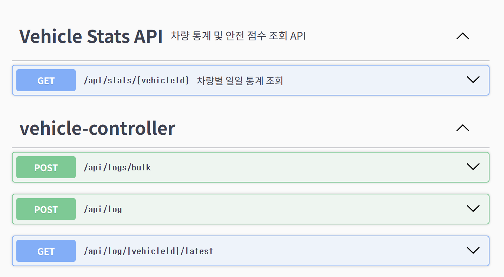

# 🚗 SafeCar : 대규모 모빌리티 센서 데이터 모니터링 시스템

차량에서 1초 단위로 유입되는 대규모 센서 데이터(속도, RPM)를 실시간으로 수집하고, 비동기 메시지 큐 기반 파이프라인을 통해 데이터 유실 없이 이상 징후를 탐지 및 안전 점수를 산출하는 백엔드 시스템입니다.

단순한 데이터 적재를 넘어, 대규모 트래픽 상황에서의 자원 경합 해결과 데이터베이스 부하 최소화를 위한 아키텍처 최적화에 집중했습니다.

<br>

## 🛠 Tech Stack

- Language: Java 17
- Framework: Spring Boot 3.0.2, Spring Data JPA
- Database & Cache: PostgreSQL, Redis
- Message Queue: RabbitMQ
- Test & Monitoring: JUnit5, JMeter, Spring Boot Actuator, Prometheus
- Infra & CI/CD: Docker, Docker Compose, GitHub Actions

<br>

## 📌 아키텍처 흐름

1. [Data Ingestion] 클라이언트(차량)로부터 센서 데이터 대량 유입 (POST `/api/log`)
2. [Main Transaction] 핵심 센서 데이터를 PostgreSQL에 즉시 적재
3. [Event Produce] 부가 로직(이상 탐지, 알림) 처리를 위해 RabbitMQ로 메시지 비동기 발행
4. [Event Consume] MQ Consumer가 Redis 최신 상태 갱신 및 경고(Alert) DB 저장 수행
5. [Batch Processing] Spring Scheduler 기반의 중간 집계(Rolling Aggregation) 및 자정 안전 점수 산출

<br>

## 🔥 핵심 기술 및 트러블슈팅

### 1. RabbitMQ 도입을 통한 대규모 트래픽 내결함성 확보 및 커넥션 풀 튜닝
* 문제 상황: VUSER 5,000명 규모의 극한 부하 테스트 시, 센서 데이터 저장(메인 트랜잭션)과 알림 처리(부가 로직)가 동기적으로 묶여 톰캣 스레드 대기열 폭주 및 DB 커넥션 고갈 발생. (에러율 52.10% 기록)
* 해결 및 튜닝: 
    * 부가 로직을 RabbitMQ 기반의 Producer-Consumer 구조로 분리하여 외부 큐로 위임.
    * Tomcat Thread(12), HikariCP(17), RabbitMQ Consumer Concurrency(1), Prefetch(10)로 수치를 정교하게 튜닝.
    * DB 커넥션을 API 응답 스레드에 집중시키고, Consumer는 메시지를 큐에서 점진적으로 가져가 백그라운드에서 처리하도록 자원 분배.
* 결과: 트래픽 폭주 시 내부 DB가 뻗는 대신 앞단에서 연결을 제어하는 Fail-Fast 아키텍처 구축. 에러율 0%로 안정적인 비동기 파이프라인 검증 완료.

### 2. 중간 집계(Rolling Aggregation) 배치 파이프라인 구축
* 문제 상황: 수천만 건의 일일 센서 데이터를 자정에 한 번에 정산할 경우 발생하는 RDBMS의 Lock 현상과 메모리 과부하 리스크.
* 해결 방안: Spring Scheduler를 활용하여 1시간 단위로 데이터를 미리 계산(평균/최고 속도)하여 요약 테이블(`HourlyVehicleStats`)에 적재.
* 결과: 최종 일일 정산 시 스캔해야 하는 데이터 모수를 획기적으로 줄여 최종 배치 처리 속도 최적화 및 DB 부하 분산.

### 3. 벌크 인서트(Bulk Insert) 최적화로 네트워크 I/O 병목 제거
* 문제 상황: 대량의 데이터를 `JPA saveAll()`로 처리 시 단건 쿼리가 반복적으로 발생하여 네트워크 I/O 오버헤드 증가.
* 해결 방안: `JdbcTemplate.batchUpdate`를 도입하여 1,000건 단위로 묶어 DB에 전송하도록 최적화 적용.

<br>

## ⚙️ 주요 기능 및 API 문서


| API | Method | Endpoint | Description |
|---|---|---|---|
| 단건 센서 데이터 수집 | POST | `/api/log` | 차량 센서 데이터 수집 및 비동기 처리 파이프라인 시작 |
| 대량 센서 데이터 수집 | POST | `/api/logs/bulk` | 대규모 트래픽 테스트를 위한 벌크 인서트 API |
| 최신 상태 조회 | GET | `/api/log/{vehicleId}/latest` | Redis 캐싱 기반의 차량 최신 운행 상태 O(1) 조회 |
| 일일 통계 및 안전 점수 조회 | GET | `/api/stats/{vehicleId}` | 배치로 계산된 일별 통계 및 안전 점수 조회 |

> 💡 상세 요청/응답 파라미터 및 API 테스트는 로컬 서버 구동 후 `http://localhost:8080/swagger-ui/index.html`에서 확인할 수 있습니다.

<br>

## 🚀 CI/CD 및 실행 방법

### CI/CD 파이프라인
- GitHub Actions를 연동하여 `main` 브랜치 Push 및 PR 발생 시 JDK 17 환경에서 자동으로 단위 테스트 및 빌드를 수행하여 무결성을 검증합니다.

### Local Environment Setup
Docker Compose를 사용하여 애플리케이션에 필요한 인프라(PostgreSQL, Redis, RabbitMQ)를 컨테이너 환경에서 한 번에 구축합니다.

```bash
# 1. 프로젝트 클론 및 디렉토리 이동
$git clone [https://github.com/dev-chanyoung/SensorDetectionSystem.git$](https://github.com/dev-chanyoung/SensorDetectionSystem.git$) cd SensorDetectionSystem

# 2. 인프라(PostgreSQL, Redis, RabbitMQ) 컨테이너 백그라운드 실행
$ docker-compose up -d

# 3. 애플리케이션 빌드 및 실행 (로컬 환경)
$ ./gradlew bootRun