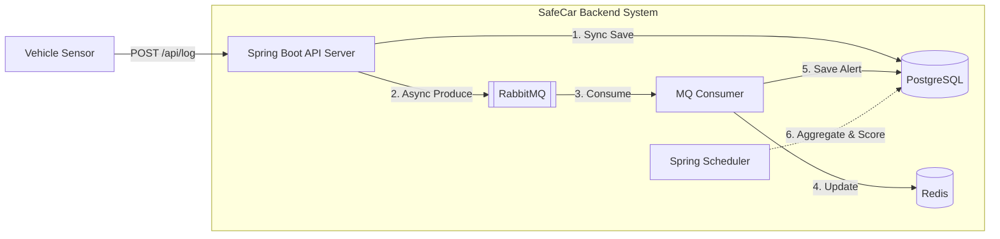
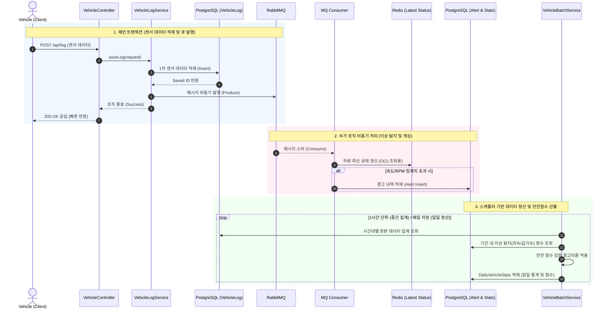
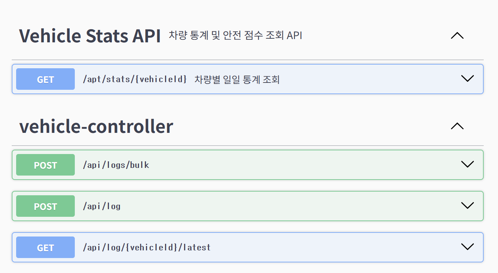

# 🚗 SafeCar : 대규모 모빌리티 센서 데이터 모니터링 시스템

차량에서 1초 단위로 유입되는 대규모 센서 데이터(속도, RPM)를 실시간으로 수집하고, 비동기 메시지 큐 기반 파이프라인을 통해 데이터 유실 없이 이상 징후를 탐지 및 안전 점수를 산출하는 백엔드 시스템입니다.

단순한 데이터 적재를 넘어, 대규모 트래픽 상황에서의 자원 경합 해결과 데이터베이스 부하 최소화를 위한 아키텍처 최적화에 집중했습니다.

<br>

## 🛠 Tech Stack

- Language: Java 17
- Framework: Spring Boot 3.0.2, Spring Data JPA
- Database & Cache: PostgreSQL, Redis
- Message Queue: RabbitMQ
- Test & Monitoring: JUnit5, JMeter, Spring Boot Actuator, Prometheus
- Infra & CI/CD: Docker, Docker Compose, GitHub Actions

<br>

## 📌 아키텍처 흐름

```mermaid
flowchart LR
    Client[Vehicle Sensor] -->|POST /api/log| API[Spring Boot API Server]

    subgraph "SafeCar Backend System"
        API -->|1. Sync Save| DB[(PostgreSQL)]
        API -->|2. Async Produce| MQ[[RabbitMQ]]

        MQ -->|3. Consume| Listener[MQ Consumer]
        Listener -->|4. Update| Cache[(Redis)]
        Listener -->|5. Save Alert| DB

        Batch[Spring Scheduler] -.->|6. Aggregate & Score| DB
    end
```
1. [Data Ingestion] 클라이언트(차량)로부터 센서 데이터 대량 유입 (POST `/api/log`)
2. [Main Transaction] 핵심 센서 데이터를 PostgreSQL에 즉시 적재
3. [Event Produce] 부가 로직(이상 탐지, 알림) 처리를 위해 RabbitMQ로 메시지 비동기 발행
4. [Event Consume] MQ Consumer가 Redis 최신 상태 갱신 및 경고(Alert) DB 저장 수행
5. [Batch Processing] Spring Scheduler 기반의 중간 집계(Rolling Aggregation) 및 자정 안전 점수 산출

<br>

## 🔥 핵심 기술 및 트러블슈팅

### 1. 🧠 성능 최적화 Deep Dive: 자원 경합 해결 및 고가용성 파이프라인 구축

**[Challenge: 동기 처리 아키텍처의 한계와 DB 커넥션 고갈]**
* 초당 1,000건 이상의 차량 센서 데이터 실시간 수집을 목표로 VUSER 5,000명 규모의 극한 부하 테스트를 진행했습니다.
* 초기에는 단일 API 스레드가 데이터 저장과 이상 탐지 로직(DB Insert 2회)을 모두 동기적으로 수행했습니다. 그 결과, 극한 부하 시 하드웨어 한계인 **17개의 DB 커넥션 풀이 순식간에 고갈되며 52.10%의 500 에러**가 발생하는 치명적인 병목을 확인했습니다.

**[Action 1: 비동기 메시지 큐(RabbitMQ) 도입 및 벌크 인서트 적용]**
* **MQ 도입:** 알람 처리 등의 부가 로직을 RabbitMQ 기반의 Producer-Consumer 구조로 분리하여 외부 큐로 위임했습니다.
* **풍선 효과(I/O 병목) 해결:** 대량 데이터 저장 시, 단건 처리로 인한 네트워크 I/O 블로킹이 발생하며 톰캣 대기열이 터지는 이슈가 발생했습니다. 이를 해결하기 위해 JPA `saveAll()`을 걷어내고 `JdbcTemplate.batchUpdate`를 적용해 쿼리 전송을 최소화했으며, MQ 발행(Publish) 역시 Batch 처리로 개편했습니다.


```mermaid
sequenceDiagram
    autonumber
    actor Client as Vehicle (Client)
    participant API as VehicleController
    participant Service as VehicleLogService
    participant DB as PostgreSQL (VehicleLog)
    participant MQ as RabbitMQ
    participant Listener as MQ Consumer
    participant Redis as Redis (Latest Status)
    participant AlertDB as PostgreSQL (Alert & Stats)
    participant Batch as VehicleBatchService

    %% 1. 데이터 수집 및 비동기 발행
    rect rgb(240, 248, 255)
    Note over Client, MQ: 1. 메인 트랜잭션 (센서 데이터 적재 및 큐 발행)
    Client->>API: POST /api/log (센서 데이터)
    API->>Service: saveLog(request)
    Service->>DB: 1차 센서 데이터 적재 (Insert)
    DB-->>Service: Saved ID 반환
    Service->>MQ: 메시지 비동기 발행 (Produce)
    Service-->>API: 로직 종료 (Success)
    API-->>Client: 200 OK 응답 (빠른 반환)
    end

    %% 2. 비동기 컨슈머 로직
    rect rgb(255, 240, 245)
    Note over MQ, AlertDB: 2. 부가 로직 비동기 처리 (이상 탐지 및 캐싱)
    MQ-->>Listener: 메시지 소비 (Consume)
    Listener->>Redis: 차량 최신 상태 갱신 (O(1) 조회용)
    alt 속도/RPM 임계치 초과 시
        Listener->>AlertDB: 경고 내역 적재 (Alert Insert)
    end
    end

    %% 3. 스케줄러 배치 로직
    rect rgb(240, 255, 240)
    Note over AlertDB, Batch: 3. 스케줄러 기반 데이터 정산 및 안전점수 산출
    loop 1시간 단위 (중간 집계) / 매일 자정 (일일 정산)
        Batch->>DB: 시간대별 원본 데이터 집계 조회
        Batch->>AlertDB: 기간 내 이상 탐지(과속/급가속) 횟수 조회
        Batch->>Batch: 안전 점수 감점 알고리즘 적용
        Batch->>AlertDB: DailyVehicleStats 적재 (일일 통계 및 점수)
    end
    end
```


**[Action 2: 스레드 튜닝과 자원 경합(Resource Contention) 완화]**
* **이슈:** 처리량(TPS)을 높이기 위해 Tomcat 스레드를 15개, MQ Consumer 스레드를 2개로 세팅하자 합계(17개)가 전체 DB 풀(17개)의 100%를 점유했습니다. 이로 인해 API 스레드와 Consumer 스레드 간의 **DB 커넥션 쟁탈전**이 발생하며 48.64%의 타임아웃 에러가 재발생했습니다.
* **해결 (Throttling):** DB 커넥션을 API 응답 스레드에 양보하고, Consumer는 백그라운드에서 천천히 처리하도록 세부 파라미터를 조정하여 자원 경합을 완화했습니다. 
  * 튜닝 수치: `Tomcat Thread(12)` / `HikariCP(17)` / `MQ Concurrency(1)` / `Prefetch(10)`

**[📊 최종 개선 지표 및 기술적 인사이트]**

| 테스트 단계 | 주요 튜닝 포인트 (Tomcat / DB / MQ) | 에러율 | 결과 및 비고 |
| :--- | :--- | :--- | :--- |
| **Step 0** | 동기 처리 (Tomcat: 7 / Pool: 17 / MQ: X) | **52.10%** | 부하 시 커넥션 고갈 |
| **Step 1** | MQ 도입 (Tomcat: 15 / Pool: 17 / Concurrency: 2) | **48.64%** | 스레드 간 DB 커넥션 경합 발생 |
| **Step 2** | **최적화 (Tomcat: 12 / Pool: 17 / Concurrency: 1)** | **0.00%** | **정상 부하(2,000/5s) 완벽 수용** |

> 💡 **Load Shedding 아키텍처 검증**
> 부하(5,000/5s) 초과 트래픽 발생 시, 내부 DB가 뻗게 내버려 두는 대신 앞단에서 즉시 연결을 거절하는 **Fail-Fast)** 아키텍처가 정상 작동함을 확인했습니다. 
> 한정된 하드웨어 자원 하에서는 무조건적으로 스레드를 늘리는 것보다, **"Web Thread - DB Connection Pool - MQ Consumer" 간의 치밀한 자원 분배를 통해 코어 시스템(DB)을 보호하는 것이 고가용성 설계의 핵심**임을 증명했습니다.

<br>

### 2. 중간 집계(Rolling Aggregation) 배치 파이프라인 구축
* **문제 상황:** 수천만 건의 일일 센서 데이터를 자정에 한 번에 정산할 경우 발생하는 RDBMS의 Lock 현상과 메모리 과부하 리스크.
* **해결 방안:** Spring Scheduler를 활용하여 1시간 단위로 데이터를 미리 계산(평균/최고 속도)하여 요약 테이블(`HourlyVehicleStats`)에 적재.
* **결과:** 최종 일일 정산 시 스캔해야 하는 데이터 모수를 획기적으로 줄여 최종 배치 처리 속도 최적화 및 DB 부하 분산.

<br>

## ⚙️ 주요 기능 및 API 문서


| API | Method | Endpoint | Description |
|---|---|---|---|
| 단건 센서 데이터 수집 | POST | `/api/log` | 차량 센서 데이터 수집 및 비동기 처리 파이프라인 시작 |
| 대량 센서 데이터 수집 | POST | `/api/logs/bulk` | 대규모 트래픽 테스트를 위한 벌크 인서트 API |
| 최신 상태 조회 | GET | `/api/log/{vehicleId}/latest` | Redis 캐싱 기반의 차량 최신 운행 상태 O(1) 조회 |
| 일일 통계 및 안전 점수 조회 | GET | `/api/stats/{vehicleId}` | 배치로 계산된 일별 통계 및 안전 점수 조회 |

> 💡 상세 요청/응답 파라미터 및 API 테스트는 로컬 서버 구동 후 `http://localhost:8080/swagger-ui/index.html`에서 확인할 수 있습니다.

<br>

## 🚀 CI/CD 및 실행 방법

### CI/CD 파이프라인
- GitHub Actions를 연동하여 `main` 브랜치 Push 및 PR 발생 시 JDK 17 환경에서 자동으로 단위 테스트 및 빌드를 수행하여 무결성을 검증합니다.

### Local Environment Setup
Docker Compose를 사용하여 애플리케이션에 필요한 인프라(PostgreSQL, Redis, RabbitMQ)를 컨테이너 환경에서 한 번에 구축합니다.

```bash
# 1. 프로젝트 클론 및 디렉토리 이동
$ git clone https://github.com/dev-chanyoung/SensorDetectionSystem.git
$ cd SensorDetectionSystem

# 2. 인프라(PostgreSQL, Redis, RabbitMQ) 컨테이너 백그라운드 실행
$ docker-compose up -d

# 3. 애플리케이션 빌드 및 실행 (로컬 환경)
$ ./gradlew bootRun
```

<br>

## 💡 회고 및 배운 점 (Retrospective)

**"Scale-up 이전에, 애플리케이션 레벨의 파라미터 튜닝이 성능에 미치는 결정적 영향력"**

이번 프로젝트를 통해 단순히 하드웨어 스펙에 의존하는 것이 아니라, 주어진 리소스 환경 내에서 소프트웨어 설정을 최적화하는 과정이 얼마나 중요한지 깊이 체감할 수 있었습니다. 

초기 부하 테스트에서 직면한 높은 에러율과 처리 지연 문제를 해결하기 위해 Tomcat Thread Pool, HikariCP 커넥션 수, RabbitMQ Prefetch Count 등의 세부 파라미터를 조절해 보았습니다. 이 과정에서 각 설정값이 전체 시스템 파이프라인 중 어느 병목 구간에 어떻게 작용하는지 가시적으로 확인할 수 있었습니다. 

동일한 하드웨어 환경임에도 불구하고 이 **파라미터 최적화** 작업만으로 에러율을 극적으로 낮추고 처리 속도를 개선해 내면서, 서비스의 트래픽 특성과 인프라 환경에 꼭 맞는 세밀한 튜닝 역량이 백엔드 개발자의 핵심 경쟁력임을 깨달았습니다.
