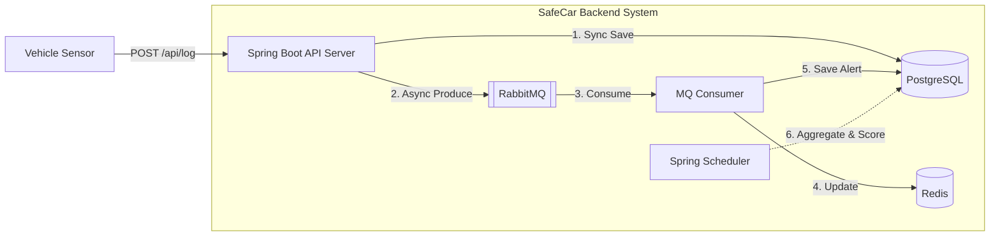
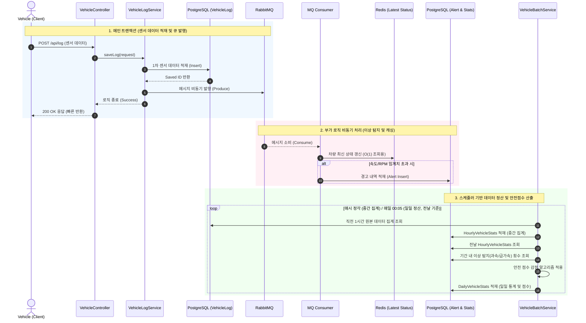
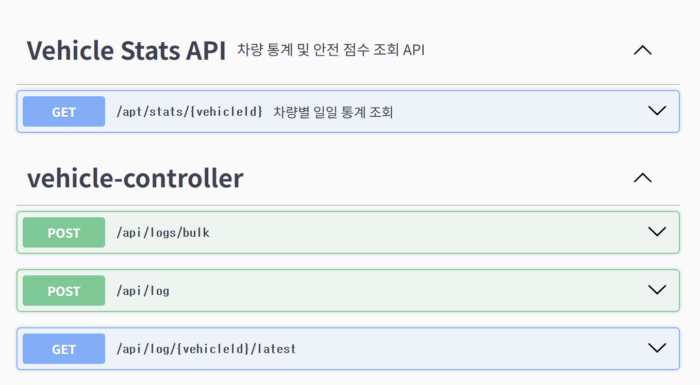

# 🚗 SafeCar : 대규모 모빌리티 센서 데이터 모니터링 시스템

차량에서 1초 단위로 유입되는 대규모 센서 데이터(속도, RPM)를 실시간으로 수집하고, 비동기 메시지 큐 기반 파이프라인을 통해 이상 징후를 탐지하고 안전 점수를 산출하는 백엔드 시스템입니다.

단순한 데이터 적재를 넘어, 부가 로직을 메시지 큐로 분리한 비동기 파이프라인을 설계하고, 부하 테스트로 처리량과 에러율을 측정·검증하는 데 집중했습니다.

<br>

## 🛠 Tech Stack

- Language: Java 17
- Framework: Spring Boot 3.0.2, Spring Data JPA
- Database & Cache: PostgreSQL, Redis
- Message Queue: RabbitMQ
- Test & Monitoring: JUnit5, JMeter, Custom SensorSimulator(자체 구현), Spring Boot Actuator, Prometheus
- Infra & CI/CD: Docker, Docker Compose, GitHub Actions

<br>

## 📌 아키텍처 흐름

```mermaid
flowchart LR
    Client[Vehicle Sensor] -->|POST /api/log| API[Spring Boot API Server]

    subgraph "SafeCar Backend System"
        API -->|1. Sync Save| DB[(PostgreSQL)]
        API -->|2. Async Produce| MQ[[RabbitMQ]]

        MQ -->|3. Consume| Listener[MQ Consumer]
        Listener -->|4. Update| Cache[(Redis)]
        Listener -->|5. Save Alert| DB

        Batch[Spring Scheduler] -.->|6. Aggregate & Score| DB
    end
```
1. [Data Ingestion] 클라이언트(차량)로부터 센서 데이터 대량 유입 (POST `/api/log`)
2. [Main Transaction] 핵심 센서 데이터를 PostgreSQL에 즉시 적재
3. [MQ Produce] 메인 트랜잭션 내에서 RabbitMQ로 메시지 발행 — 알람 처리 등 부가 로직을 메인 스레드에서 완전히 분리
4. [Event Consume] MQ Consumer가 Redis 최신 상태 갱신 및 경고(Alert) DB 저장 수행
5. [Batch Processing] Spring Scheduler 기반의 중간 집계(Rolling Aggregation, 기본 매시 정각)와 일일 정산(기본 매일 00:05, 전날 기준)으로 안전 점수 산출

<br>

## 🔥 핵심 기술 및 트러블슈팅

### 1. RabbitMQ 기반 비동기 파이프라인과 부하 테스트

**[배경]**
* 초당 1,000건 이상의 차량 센서 데이터 실시간 수집을 목표로, JMeter와 실제 센서 유입 환경을 모사하는 자체 SensorSimulator로 부하 테스트 환경을 구성했습니다.
* 초기(2월 19~20일)에는 센서 데이터 저장과 이상 탐지(Alert 저장), Redis 갱신이 하나의 요청 흐름에 묶여 있었고, 2월 21일 Spring Event + `@Async`로 이상 탐지·Redis 갱신을 분리했습니다. 부하 테스트에서 에러율 52.10%가 나온 구조가 이 `@Async` 방식이며, 이후 RabbitMQ로 교체했습니다(아래 ADR).

**[비동기 메시지 큐(RabbitMQ) 도입과 벌크 인서트]**
* **MQ 도입 및 결합도 분리:** 알람 처리 등의 부가 로직을 RabbitMQ 기반의 Producer-Consumer 구조로 위임하여 메인 트랜잭션과 분리했습니다.
* **설계 변경(ADR): Spring Event → RabbitMQ.** 처음에는 서비스 계층에서 직접 MQ를 호출하지 않고 `ApplicationEvent` + `@TransactionalEventListener(phase = AFTER_COMMIT)`로 결합도를 분리하는 방식을 시도했습니다. 하지만 두 가지 한계가 명확했습니다 — ① 인메모리 이벤트라 서버가 커밋 직후 죽으면 아직 처리되지 않은 이벤트가 그냥 유실되고(내구성 없음), ② `@EnableAsync`의 기본 실행기는 스레드가 8개로 고정이지만 대기열 크기에 제한이 없어, 대량 이벤트가 한꺼번에 쏟아지면 처리되지 못한 이벤트가 메모리에 계속 쌓일 위험이 있었습니다. RabbitMQ는 큐를 `durable=true`로 선언해 서버가 죽어도 메시지가 보존되고, Consumer의 동시성(Concurrency)·Prefetch를 명시적으로 제한할 수 있어 이 두 문제를 구조적으로 해결합니다. 그래서 이벤트 기반 결합도 분리는 유지하되, 전달 수단만 Spring의 인메모리 이벤트에서 RabbitMQ로 교체했습니다 — 현재 `VehicleLogService`는 메인 트랜잭션 안에서 `RabbitTemplate`으로 직접 발행합니다. **알려진 트레이드오프:** 이 발행은 DB 트랜잭션이 실제로 커밋되기 전(같은 메서드 내부)에 일어나므로, `save()` 성공 이후 커밋 시점 사이에 트랜잭션이 롤백되면 아직 반영되지 않은 데이터에 대한 메시지가 큐에 먼저 나가는 "유령 메시지" 가능성이 이론적으로 남아 있습니다. 예전 Spring Event 버전은 `AFTER_COMMIT` 시점에만 발행해 이 문제가 없었지만, 이번 프로젝트 규모에서는 발생 확률이 낮고 영향도(중복 이상탐지 로직 1회 공회전)도 작아 완전한 해결(Transactional Outbox 패턴 등) 대신 트레이드오프로 남겨두기로 했습니다.
* **벌크 인서트:** 대량 저장 API(`/api/logs/bulk`)는 IDENTITY 전략 때문에 JPA `saveAll()`로는 배치 insert가 되지 않아, `JdbcTemplate.batchUpdate`로 1,000건씩 묶어 전송하고 MQ 발행도 목록 단위로 한 번에 하도록 바꿔 쿼리·발행 횟수를 줄였습니다.


```mermaid
sequenceDiagram
    autonumber
    actor Client as Vehicle (Client)
    participant API as VehicleController
    participant Service as VehicleLogService
    participant DB as PostgreSQL (VehicleLog)
    participant MQ as RabbitMQ
    participant Listener as MQ Consumer
    participant Redis as Redis (Latest Status)
    participant AlertDB as PostgreSQL (Alert & Stats)
    participant Batch as VehicleBatchService

    %% 1. 데이터 수집 및 비동기 발행
    rect rgb(240, 248, 255)
    Note over Client, MQ: 1. 메인 트랜잭션 (센서 데이터 적재 및 큐 발행)
    Client->>API: POST /api/log (센서 데이터)
    API->>Service: saveLog(request)
    Service->>DB: 1차 센서 데이터 적재 (Insert)
    DB-->>Service: Saved ID 반환
    Service->>MQ: 메시지 비동기 발행 (Produce)
    Service-->>API: 로직 종료 (Success)
    API-->>Client: 200 OK 응답 (빠른 반환)
    end

    %% 2. 비동기 컨슈머 로직
    rect rgb(255, 240, 245)
    Note over MQ, AlertDB: 2. 부가 로직 비동기 처리 (이상 탐지 및 캐싱)
    MQ-->>Listener: 메시지 소비 (Consume)
    Listener->>Redis: 차량 최신 상태 갱신 (O(1) 조회용)
    alt 속도/RPM 임계치 초과 시
        Listener->>AlertDB: 경고 내역 적재 (Alert Insert)
    end
    end

    %% 3. 스케줄러 배치 로직
    rect rgb(240, 255, 240)
    Note over AlertDB, Batch: 3. 스케줄러 기반 데이터 정산 및 안전점수 산출
    loop 매시 정각 (중간 집계) / 매일 00:05 (일일 정산, 전날 기준)
        Batch->>DB: 직전 1시간 원본 데이터 집계 조회
        Batch->>AlertDB: HourlyVehicleStats 적재 (중간 집계)
        Batch->>AlertDB: 전날 HourlyVehicleStats 조회
        Batch->>AlertDB: 기간 내 이상 탐지(과속/급가속) 횟수 조회
        Batch->>Batch: 안전 점수 감점 알고리즘 적용
        Batch->>AlertDB: DailyVehicleStats 적재 (일일 통계 및 점수)
    end
    end
```


**[설정]**
* Tomcat Thread 12, HikariCP 최대 풀 17(코어 8 × 2 + 1), RabbitMQ Consumer 1, Prefetch 10.
* 스레드 수의 시작값은 공식 N_cpu × U_cpu × (1 + 대기시간/연산시간)으로 잡았습니다(코어 8, 목표 CPU 사용률 0.7, 초기 측정에서 대기 5ms / 연산 35.68ms). 이후 API 스레드와 Consumer가 쓰는 커넥션이 풀 17 안에서 여유를 두도록 Tomcat 12 + Consumer 1로 나눴습니다.

**[📊 부하 테스트 결과]**
* 조건: JMeter CLI 모드, ramp-up 5초 / loop 10, `POST /api/log`. 서버와 JMeter를 같은 노트북(8코어)에서 실행했습니다.

| 부하 | 설정 | 에러율 | 성공 요청 처리량 | 평균 응답 시간 |
| :--- | :--- | :--- | :--- | :--- |
| VUSER 5,000 (50,000건, 2회) | Tomcat 12 / Consumer 1 / Prefetch 10 (현재 설정) | 0% / 0% | 1,894/s / 2,066/s | 1.54초 / 1.20초 |
| VUSER 5,000 (50,000건, 2회) | Tomcat 15 / Consumer 2 / Prefetch 10 (비교) | 0.94% / 0.68% | 1,962/s / 1,948/s | 1.46초 / 1.46초 |
| VUSER 2,000 (20,000건, 1회) | Tomcat 12 / Consumer 1 / Prefetch 10 (현재 설정) | 0% | 1,545/s | 0.85초 |

* 실패한 요청은 모두 연결 단계의 거절(`Connection refused`)이었고, 서버 내부 예외(500)와 DB 커넥션 대기 타임아웃은 없었습니다.
* 위 표의 모든 실행에서 **성공 응답 수와 DB에 저장된 행 수가 일치**했고, 이상 탐지 Alert도 요청마다 2건(과속·급가속)씩 빠짐없이 저장됐습니다.
* 측정 방법: 처리되지 않은 예외 로그, 1초 간격 커넥션 풀·힙 모니터, RabbitMQ 큐 적재량 기록, 측정 후 DB 행 수 대조.

<br>

### 2. 중간 집계(Rolling Aggregation) 배치 파이프라인 구축
* **문제 상황:** 수천만 건의 일일 센서 데이터를 자정에 한 번에 정산할 경우 발생하는 RDBMS의 Lock 현상과 메모리 과부하 리스크.
* **해결 방안:** Spring Scheduler를 활용하여 1시간 단위로 데이터를 미리 계산(평균/최고 속도)하여 요약 테이블(`HourlyVehicleStats`)에 적재.
* **구현:** 중간 집계 배치가 구간별 평균·최고 속도·건수를 `HourlyVehicleStats`에 적재하고, 일일 정산은 원본 로그 대신 이 요약 테이블을 읽어 건수로 가중한 하루 평균과 안전 점수를 계산합니다. 같은 차량·날짜를 다시 정산하면 기존 행을 갱신합니다. 주기와 집계 구간은 `application.properties`의 `batch.*`로 조정하며, 기본값은 중간 집계 매시 정각 / 일일 정산 매일 00:05(전날 기준)입니다.
* **변경 시점:** 2026년 2월 구현은 기능 확인을 위해 중간 집계를 매분, 일일 정산을 매시 정각에 실행하도록 주기를 줄여 두었고, 일일 정산은 원본 로그를 직접 집계했습니다. 주기 설정화와 요약 테이블 조회는 2026-09-30에 반영했습니다.

<br>

## ⚙️ 주요 기능 및 API 문서


| API | Method | Endpoint | Description |
|---|---|---|---|
| 단건 센서 데이터 수집 | POST | `/api/log` | 차량 센서 데이터 수집 및 비동기 처리 파이프라인 시작 |
| 대량 센서 데이터 수집 | POST | `/api/logs/bulk` | 대규모 트래픽 테스트를 위한 벌크 인서트 API |
| 최신 상태 조회 | GET | `/api/log/{vehicleId}/latest` | Redis 캐싱 기반의 차량 최신 운행 상태 O(1) 조회 |
| 일일 통계 및 안전 점수 조회 | GET | `/api/stats/{vehicleId}` | 배치로 계산된 일별 통계 및 안전 점수 조회 |

> 💡 상세 요청/응답 파라미터 및 API 테스트는 로컬 서버 구동 후 `http://localhost:8080/swagger-ui/index.html`에서 확인할 수 있습니다.

<br>

## 🚀 CI/CD 및 실행 방법

### CI/CD 파이프라인
- GitHub Actions를 연동하여 `main` 브랜치 Push 및 PR 발생 시 JDK 17 환경에서 자동으로 단위 테스트 및 빌드를 수행하여 무결성을 검증합니다.

### Local Environment Setup
Docker Compose를 사용하여 애플리케이션에 필요한 인프라(PostgreSQL, Redis, RabbitMQ)를 컨테이너 환경에서 한 번에 구축합니다. DB와 RabbitMQ 접속 정보는 로컬 개발용 기본값입니다.

```bash
# 1. 프로젝트 클론 및 디렉토리 이동
$ git clone https://github.com/dev-chanyoung/SensorDetectionSystem.git
$ cd SensorDetectionSystem

# 2. 인프라(PostgreSQL, Redis, RabbitMQ) 컨테이너 백그라운드 실행
$ docker-compose up -d postgres redis rabbitmq

# 3. 애플리케이션 빌드 및 실행 (로컬 환경)
$ ./gradlew bootRun
```

<br>

## 💡 회고 및 배운 점 (Retrospective)

**"설정값은 근거로 정하고, 결과는 같은 조건에서 반복해 확인한다"**

스레드 수는 CPU 코어 수와 대기/연산 시간 비율 공식으로 시작값을 잡고, 커넥션 풀은 코어 수 × 2 + 1로 정하는 등 설정값마다 근거를 두고 정했습니다.

부하 테스트에서는 에러율만 보지 않고 에러의 종류, 커넥션 풀 대기, 큐 적재량을 함께 기록하고, 성공 응답 수를 DB 행 수와 대조해 결과를 확인했습니다. 같은 설정도 부하 도구의 실행 방식에 따라 결과가 크게 달라질 수 있어, 측정 환경까지 같은 조건으로 맞추고 반복 측정해야 수치를 믿을 수 있다는 것을 배웠습니다.

추가로, AI 코드 리뷰로 README와 실제 구현이 어긋난 부분(Spring Event 관련 서술)을 발견했고, 이를 그대로 반영하지 않고 커밋 이력과 트러블슈팅 기록을 직접 대조해 왜 그 구조로 바뀌었는지 근거를 추적한 뒤 문서를 정정했습니다.
